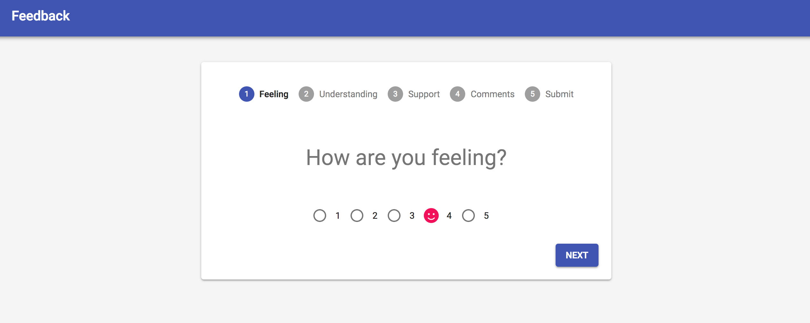
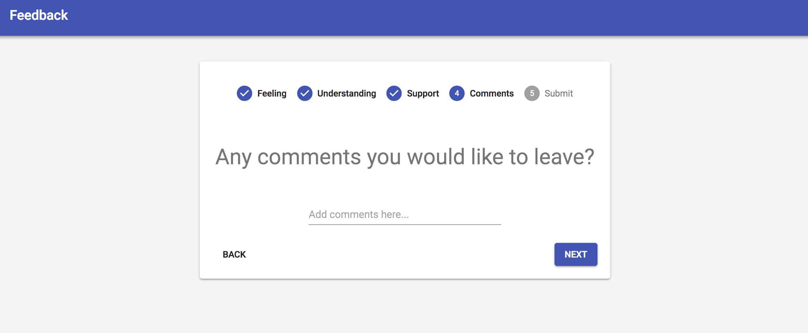
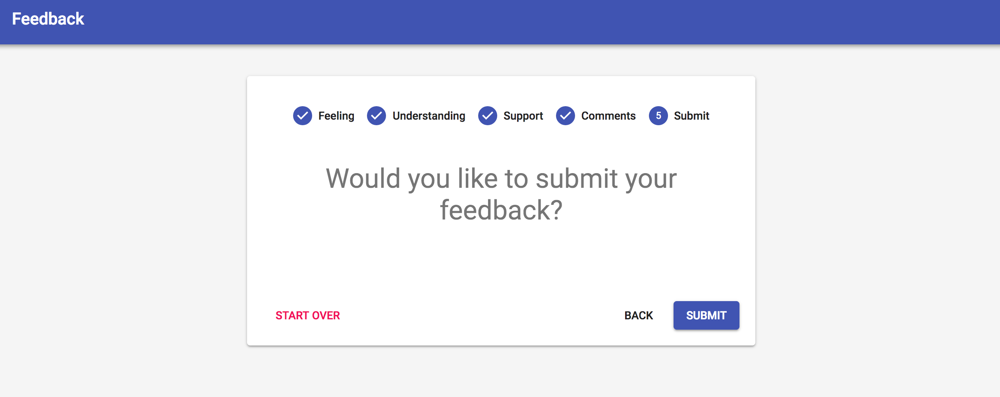
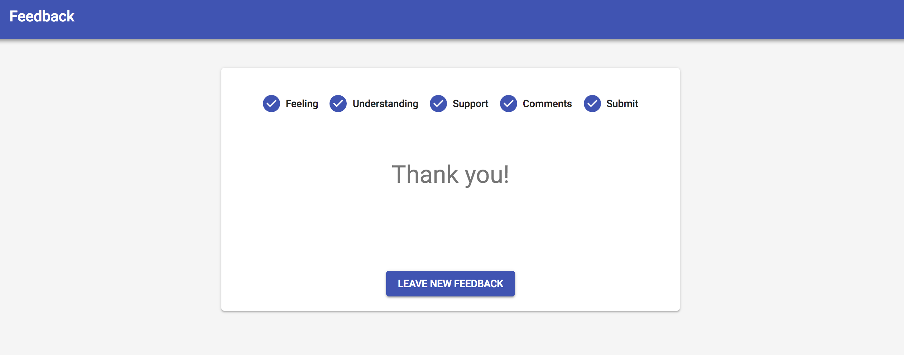
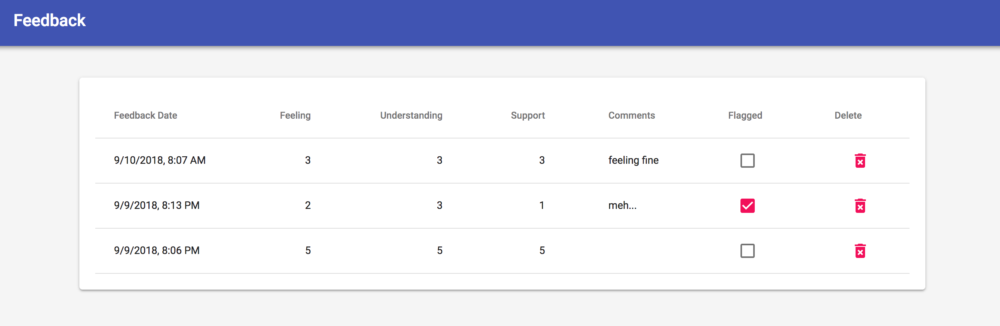

# React-Redux Feedback Form Application
The seventh weekend project for Prime Digital Academy was to practice using Redux with React and React Router by creating an application for filling out a multi-view feedback form.

## Built With
React, Redux, React Router, Node, Express, PostgreSQL, pg, Material-UI, Font Awesome, MomentJS, 

## Installation/Setup
This application is hosted live via Heroku here:
[https://mighty-temple-11989.herokuapp.com/](https://mighty-temple-11989.herokuapp.com/).

If you would like to set up this application on your local machine, first clone this repository:
```bash
mkdir prime_feedback
cd prime_feedback
git clone https://github.com/pheggeseth/Prime-Feedback
npm install
```
You will then need to set up the database in PostgreSQL:
```sql
-- Create the database either with this command,
-- or manually in a program like Postico
CREATE DATABASE "prime_feedback";

-- Create the table to store feedback
CREATE TABLE "feedback" (
  "id" serial primary key,
  "feeling" INT not null,
  "understanding" INT not null,
  "support" INT not null,
  "comments" text,
  "flagged" boolean default false,
  -- a timestamp called date is automatically generated
  -- when we save a new feedback entry in the database
  -- we can see this date in the "/admin" view
  "date" timestamp not null default CURRENT_TIMESTAMP
); 

-- Sample feedback item
INSERT INTO "feedback" ("feeling", "understanding", "support", "comments")
VALUES (4, 4, 5, 'Doing Great!');

-- Check to see the feedback in the database, if you want.
SELECT * FROM "feedback";
```

## Application Walkthrough
Upon visiting the application, users are automatically redirected to the first page of the form (any unrecognized URL paths are also redirected to this first page). The user goes through a series of views where they are asked to provide feedback on a scale of 1 to 5 (note the custom radio buttons using icons from Font Awesome!):


The user eventually gets to a view where they may leave optional comments:


and is then brought to a view where they may submit their feedback:



There is also an admin view, which is only visible at `/admin`. This view shows a table of all submitted feedback and includes the ability to both permanently delete each feedback entry form the database (a confirmation dialog appears first), and also the ability to flag an entry for further review (Flagging an entry changes that entry's `flagged` property in the database from `false` to `true`):


## Accomplishments
- first time using basic Material-UI
- created a generic MessageSnackbar component to wrap around the Material-UI Snackbar component:
```javascript
<MessageSnackbar 
  open={this.state.showSnackbar}
  onClose={this.handleSnackbarClose}
  message={'Please give feedback before continuing...'}
/>
```
- created a generic FormTemplate, which is used to generate all of the form views that collect actual data. Most of the form views simply render an instance of this component:
```javascript
class UnderstandingView extends Component {
  render() {
    return(
      <FormTemplate 
        category="understanding" 
        prompt="How well did you understand today's content?" 
        history={this.props.history}
        prevPage="/form/feeling"
        nextPage="/form/support" 
      />
    );
  }
}
```
- figured out how to use both `<Redirect />` and `<Switch>` from React Router to help improve view navigation by automatically redirecting unknown URLs to the first form view. See the [App.js](./src/components/App/App.js) component.

I also dived deep into the behavior of the React Router history prop to discover that it's possible to pass in a `state` along with the `pathname` when pushing to the history stack. I used this state to prevent the user from directly navigating to the SuccessView unless the previous page was the SubmitView, and the user clicked on the Submit button. For example, in the SubmitView, after the user clicks Submit, and the feedback is successfully saved to the database, I configured the `push` to the SuccessView to be like this:
```javascript
this.props.history.push({pathname: '/form/success', state: {prevPath: '/form/submit'}});
```
Then, in the SuccessView, the `render()` function first checks if the `location` object has a state, and if this state includes a `prevPath` of `/form/submit`. If it does, the SuccessView renders normally. If not, the SuccessView renders a `<Redirect />` component pointing to the first page of the form.

